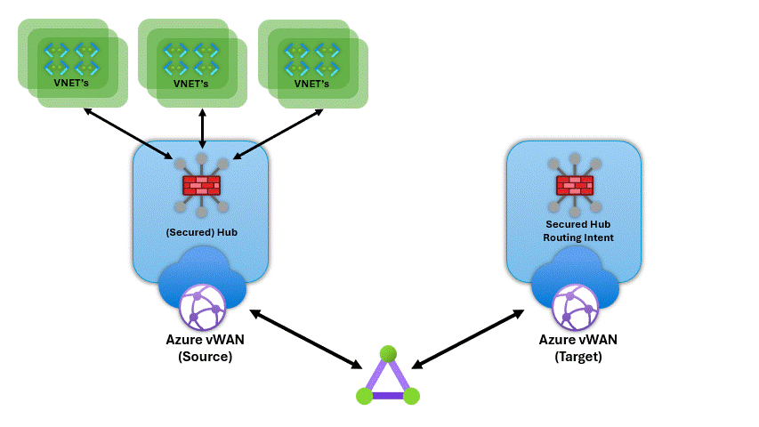
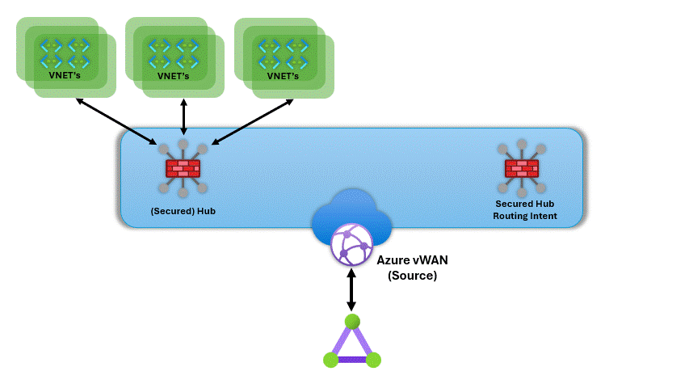

<h1>Azure-vWanVnetMover</h1>

1. [Description](#description)
2. [Use Cases](#use-cases)
3. [Parallel Jobs](#parallel-jobs)
4. [Prerequisites](#prerequisites)
5. [How to use the scripts](#how-to-use-the-scripts)
   1. [Step 1: Generate JSON file](#step-1-generate-json-file)
   2. [Step 2: (Optional) Refine JSON file(s)](#step-2-optional-refine-json-files)
   3. [Step 3a: Only check VNET connections exist in source vWAN HUB](#step-3a-only-check-vnet-connections-exist-in-source-vwan-hub)
   4. [Step 3b: Move VNET connections from source vWAN HUB to target vWAN HUB](#step-3b-move-vnet-connections-from-source-vwan-hub-to-target-vwan-hub)
   5. [Step 3c: Move VNET connections from source vWAN HUB to target vWAN HUB and adjust DNS servers in VNET's](#step-3c-move-vnet-connections-from-source-vwan-hub-to-target-vwan-hub-and-adjust-dns-servers-in-vnets)
   6. [Step 3d: Move VNET connections from source vWAN HUB to target vWAN HUB and adjust DNS servers in VNET's and enable PrivateEndpointNetworkPolicies on subnets](#step-3d-move-vnet-connections-from-source-vwan-hub-to-target-vwan-hub-and-adjust-dns-servers-in-vnets-and-enable-privateendpointnetworkpolicies-on-subnets)
6. [Logging](#logging)

## Description

The scripts in this repo can be used to move vWAN HUB VNET Connections from source vWAN HUB to an target vWAN HUB with Routing Intent enabled. The **move-VNETconnections.ps1** script will move the VNET connections from source vWAN HUB to target vWAN HUB in jobs making it possible to move a large number of VNET connections in a reasonable amount of time. The script will also adjust the DNS servers in the VNET's to the specified DNS servers. If you don't specify the DNS servers, the existing DNS servers in the VNET's will be kept. The script will also enable PrivateEndpointNetworkPolicies on each subnet where Private Endpoints are connected to. This is required when moving VNET connections to a vWAN HUB with Routing Intent enabled. This will make sure that the Private Endpoints are still reachable after moving the VNET connections to a Routing Intent enabled vWAN HUB.

The **Generate-JSON.ps1** script generates a JSON file that is used as input for the **move-VNETconnections.ps1** script to move the vWAN HUB VNET Connections from source vWAN HUB to an target vWAN HUB.

## Use Cases

You can use this in specifc scenario where you have a vWAN HUB with multiple VNET connections and you want to move these VNET connections to another vWAN HUB **including Routing Intent**. lets say you have a old vWAN HUB and an new vWAN HUB.

- You have added an extra HUB within the same vWAN (Single vWAN). On the new HUB you have enabled Routing Intent and you want to move the VNET connections from the old HUB to the new HUB.
- You have created a new vWAN (Double vWAN) including a HUB with Routing Intent enabled and you want to move the VNET connections from an existing vWAN HUB to the new vWAN HUB.

To achieve above scenarios, you can use the scripts in this repo to move the VNET connections from source vWAN HUB to target vWAN HUB.

> [!NOTE]
> The scripts will **ONLY** move the VNET connections from source vWAN HUB to target vWAN HUB with **Routing Intent enabled!**. If you are migrating from one vWAN HUB to another vWAN HUB, you need to make sure that the target vWAN HUB is configured correctly and that all other services like VPN S2S and/or P2S, ExpressRoute, Firewall, etc. are configured correctly in the target vWAN HUB.
> The scripts will **not** move the VPN, ExpressRoute, Firewall, etc. configurations from source vWAN HUB to target vWAN HUB.

| Move VNET's between vWAN's | Move VNETs between Hubs in Single vWAN |
| --- | --- |
|| |

## Parallel Jobs

The powershell script **move-VNETconnections.ps1** runs the move of the VNET connections in parallel. This will speed up the process of moving the VNET connections. This makes it possible to move a large number of VNET connections in a reasonable amount of time. Each Job runs the following steps in sequence:

1. Check if the VNET connection exists in the source vWAN HUB
2. Remove the VNET connection from the source vWAN HUB
3. Create the VNET connection in the target vWAN HUB
4. (optional) Adjust the DNS servers in the VNET to the specified DNS servers
5. (optional) Enable PrivateEndpointNetworkPolicy on each subnet with Private Endpoints*

*Note: This required when moving VNET connections to a vWAN HUB with Routing Intent enabled. This will make sure that the Private Endpoints are still reachable after moving the VNET connections. ref: [https://docs.microsoft.com/en-us/azure/virtual-wan/virtual-wan-routing-intent](https://learn.microsoft.com/en-us/azure/virtual-wan/how-to-routing-policies#:~:text=If%20you%27re%20using%20Private,configured%20on%20the%20hub.)*

## Prerequisites

- Powershell 7.1 or later
- Azure PowerShell Az Modules

## How to use the scripts

### Step 1: Generate JSON file

```powershell
.\Generate-JSON.ps1 -vWanHubId "/subscriptions/00000000-0000-0000-0000-000000000000/resourceGroups/MyResourceGroup/providers/Microsoft.Network/virtualHubs/MyvWANHub"
```

or

```powershell
.\Generate-JSON.ps1 -vWanHubId "/subscriptions/00000000-0000-0000-0000-000000000000/resourceGroups/MyResourceGroup/providers/Microsoft.Network/virtualHubs/MyvWANHub" -outputFile "VnetConnections.json"
```

This will generate a JSON file (vnets.json or what you've specified in the parameters) in the same directory where the script is executed.

If you want to move ALL vnet connections from source vWAN to target vWAN, please continue with step 3.

### Step 2: (Optional) Refine JSON file(s)

If you want to move specific vnet connections, please edit the JSON file and remove the vnet connections you don't want to move. e.g. make multiple JSON files for each batch of vnet connections you want to move.

### Step 3a: Only check VNET connections exist in source vWAN HUB

> [!NOTE]
> This will only check if the VNET connections exist in the source vWAN HUB. It will not remove or move any VNET connection.

```powershell
.\move-VNETconnections.ps1 -target_vWanHubId "/subscriptions/00000000-0000-0000-0000-000000000000/resourceGroups/MyResourceGroup/providers/Microsoft.Network/virtualHubs/MyNewvWANHub" -vnetJsonFile "VnetConnections.json" -verbose
```

### Step 3b: Move VNET connections from source vWAN HUB to target vWAN HUB

> [!WARNING]
> This will move the VNET connections from source vWAN HUB to target vWAN HUB and remove the VNET connections from source vWAN HUB.

```powershell
.\move-VNETconnections.ps1 -target_vWanHubId "/subscriptions/00000000-0000-0000-0000-000000000000/resourceGroups/MyResourceGroup/providers/Microsoft.Network/virtualHubs/MyNewvWANHub" -vnetJsonFile "VnetConnections.json" -removeandconnect -verbose
```

### Step 3c: Move VNET connections from source vWAN HUB to target vWAN HUB and adjust DNS servers in VNET's

> [!WARNING]
> This will move the VNET connections from source vWAN HUB to target vWAN HUB and remove the VNET connections from source vWAN HUB.
> This will also adjust the DNS servers in the VNET's to the specified DNS servers. Most likely the DNS servers of the target vWAN HUB are different from the source vWAN HUB.
> If you don't specify the DNS servers, the existing DNS servers in the VNET's will be kept.

```powershell
.\move-VNETconnections.ps1 -target_vWanHubId "/subscriptions/00000000-0000-0000-0000-000000000000/resourceGroups/MyResourceGroup/providers/Microsoft.Network/virtualHubs/MyNewvWANHub" -vnetJsonFile "VnetConnections.json" -RemoveAndConnect  -VNET_DNSServers "1.2.3.4","6.7.8.9" -verbose
```

### Step 3d: Move VNET connections from source vWAN HUB to target vWAN HUB and adjust DNS servers in VNET's and enable PrivateEndpointNetworkPolicies on subnets

> [!WARNING]
> This will move the VNET connections from source vWAN HUB to target vWAN HUB and remove the VNET connections from source vWAN HUB.
> This will also adjust the DNS servers in the VNET's to the specified DNS servers. Most likely the DNS servers of the target vWAN HUB are different from the source vWAN HUB. 
> If you don't specify the DNS servers, the existing DNS servers in the VNET's will be kept.
> This will also enable PrivateEndpointNetworkPolicies on each subnet where Private Endpoints are connected to.

```powershell
.\move-VNETconnections.ps1 -target_vWanHubId "/subscriptions/00000000-0000-0000-0000-000000000000/resourceGroups/MyResourceGroup/providers/Microsoft.Network/virtualHubs/MyNewvWANHub" -vnetJsonFile "VnetConnections.json" -RemoveAndConnect  -VNET_DNSServers "1.2.3.4" -EnablePrivateEndpointNetworkPolicies -verbose
```

## Logging

The script will log the output to the console and to a log file in the same directory where the script is executed. The default log file will be named `move-VNETconnections.log`.

If you want to specify a different log file, you can use the `-logFile` parameter. e.g. `-logFile "C:\temp\move-VNETconnections.log"`

Example output of log file:

```plaintext
Starting Move-VNETconnections.ps1 script at: 06/01/2024 22:21:14
JobID: 13, Job: toVNET100, Output: 0/Switching to subscription: XXXXXXXXXXX
JobID: 13, Job: toVNET100, Output: 10/Checked VNET Connection: toVNET100
JobID: 13, Job: toVNET100, Output: 20/Removing VNET connection: toVNET100 from source vWAN hub
JobID: 13, Job: toVNET100, Output: 30/removed VNET connection toVNET100 successfully
JobID: 13, Job: toVNET100, Output: 40/Switching to subscription: XXXXXXXXXXX
JobID: 13, Job: toVNET100, Output: 50/Connecting VNET connection toVNET100 to target vWAN hub
JobID: 13, Job: toVNET100, Output: 60/moved VNET connection toVNET100 successfully
JobID: 13, Job: toVNET100, Output: 70/Switching to subscription: XXXXXXXXXXX
JobID: 13, Job: toVNET100, Output: 75/Checking VNET: vnet-100
JobID: 13, Job: toVNET100, Output: 75/Updating VNET DNS servers for VNET: vnet-100 to: "1.2.3.4"
JobID: 13, Job: toVNET100, Output: 80/Private Endpoints found on subnet: default
JobID: 13, Job: toVNET100, Output: 85/Enabling PrivateEndpointNetworkPolicies on subnet: default
JobID: 13, Job: toVNET100, Output: 90/VNET updated successfully on: vnet-100
JobID: 13, Job: toVNET100, Output: 100/Completed processing VNET connection: toVNET100
JobID: 13, Job: toVNET100, Duration: 05min:35sec
JobID: 13, Job: toVNET100, Removed
JobID: 15, Job: toVNET68, Output: 0/Switching to subscription: XXXXXXXXXXX
JobID: 15, Job: toVNET68, Output: 10/Checked VNET Connection: toVNET68
JobID: 15, Job: toVNET68, Output: 20/Removing VNET connection: toVNET68 from source vWAN hub
JobID: 15, Job: toVNET68, Output: 30/removed VNET connection toVNET68 successfully
JobID: 15, Job: toVNET68, Output: 40/Switching to subscription: XXXXXXXXXXX
JobID: 15, Job: toVNET68, Output: 50/Connecting VNET connection toVNET68 to target vWAN hub
JobID: 15, Job: toVNET68, Output: 60/moved VNET connection toVNET68 successfully
JobID: 15, Job: toVNET68, Output: 70/Switching to subscription: XXXXXXXXXXX
JobID: 15, Job: toVNET68, Output: 75/Checking VNET: vnet-68
JobID: 15, Job: toVNET68, Output: 75/Updating VNET DNS servers for VNET: vnet-68 to: "1.2.3.4"
JobID: 15, Job: toVNET68, Output: 80/No Private Endpoints found on subnet: default
JobID: 15, Job: toVNET68, Output: 90/VNET updated successfully on: vnet-68
JobID: 15, Job: toVNET68, Output: 100/Completed processing VNET connection: toVNET68
JobID: 15, Job: toVNET68, Duration: 04min:56sec
JobID: 15, Job: toVNET68, Removed
Completed Move-VNETconnections.ps1 script at: 06/01/2024 22:26:49
```

Example output of console:


