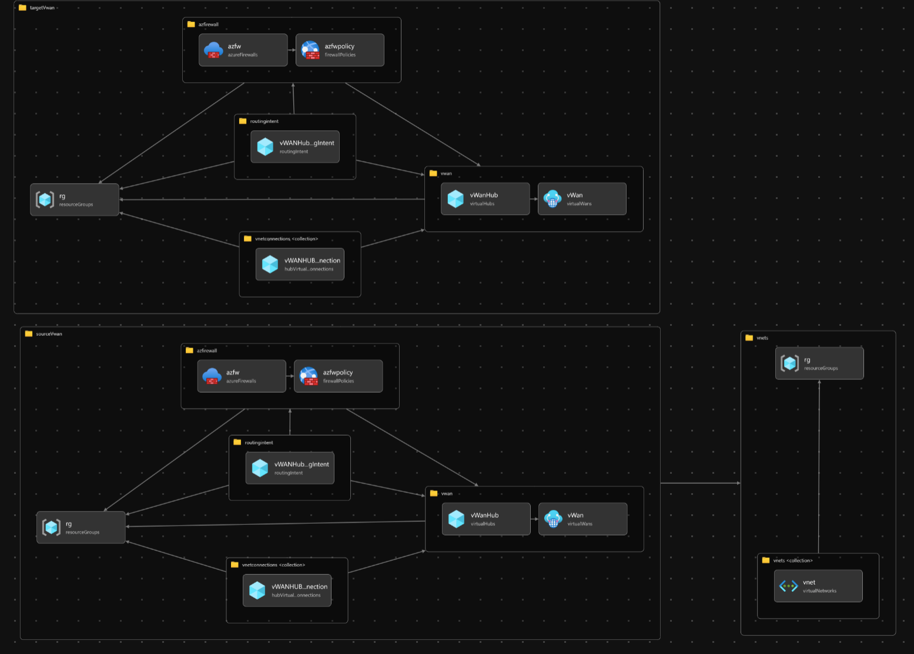

<h1>Azure vWAN source and target testing bicep template</h1>

1. [description](#description)
2. [parameters (main.bicep)](#parameters-mainbicep)
3. [Bicep visualization](#bicep-visualization)

## description

This bicep template is used to deploy a source and target vWAN hub in Azure. The source vWAN hub is used to test the move-VNETconnections.ps1 script. The target vWAN hub is used to move the VNET connections to.

Please update the parameters in the bicep file to match your environment.

>[!WARNING]
>
> - This bicep template is used for testing purposes only. Do not use this in a production environment.
> - This bicep template is created to deploy a test environment to be able to test the move-VNETconnections.ps1 script and generate the JSON file.
> - This bicep template deploys **100** VNET's in the source vWAN hub. This is done to test the performance of the move-VNETconnections.ps1 script. If you want to test with less VNET's, please update the parameters in the bicep file.

## parameters (main.bicep)

| Name | Type | Default value | Description |
|------|------|---------------|-------------|
|location|string|`deployment().location`|The location where the resources will be deployed|
|ipCIDRrange|string|`172.31.0.0/16`|The IP CIDR range|
|target_SubscriptionID|string| |The target subscription ID|
|target_RGname|string|`rg-vwan-new`|The target resource group name|
|target_vWANname|string|`vWAN-new`|The target vWAN name|
|target_vWANHUBname|string|`vWANHUB-new`|The target vWAN hub name|
|source_SubscriptionID|string| |The source subscription ID|
|source_RGname|string|`rg-vwan-old`|The source resource group name|
|source_vWANname|string|`vWAN-old`|The source vWAN name|
|source_vWANHUBname|string|`vWANHUB-old`|The source vWAN hub name|
|vnets_SubscriptionID|string| |The subscription ID where the VNET's are deployed|
|vnets_RGname|string|`rg-vnets`|The resource group name where the VNET's are deployed|
|amountOfVNETs|int|`100`|The amount of VNET's to deploy|

## Bicep visualization

